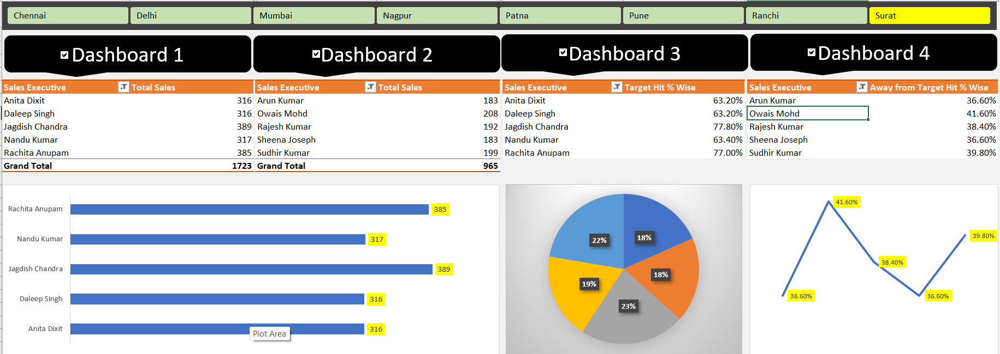

Excel-Projects
📊 Sales Performance Dashboard in Microsoft Excel

An interactive Sales Performance Dashboard built in Microsoft Excel to analyze sales executives performance, track sales targets, and visualize business insights using Pivot Tables, Pivot Charts, Slicers, and Excel formulas.

This project demonstrates how Excel can be used as a Business Intelligence (BI) tool to transform raw sales data into meaningful visual reports for better decision-making.

🚀 Project Overview

The dashboard analyzes sales data of multiple sales executives across different regions and compares their performance against predefined sales targets.

It provides quick insights into:
- Total Sales achieved by each Sales Executive
- Target Achievement Percentage
- Percentage Away from Target
- Sales Performance Comparison
- Interactive filtering using Slicers

📂 Dataset

The dataset contains information such as:
- Employee Code
- Sales Executive Name
- Region
- Daily Sales (Day 1 – Day 5)
- Total Sales
- Sales Target
- Target Hit %
- Away From Target %

📈 Dashboard Features
✅ Interactive Dashboard
✅ Pivot Tables
✅ Pivot Charts\
✅ Slicers for Dynamic Filtering
✅ KPI Cards
✅ Sales Ranking
✅ Target Achievement Analysis
✅ Performance Comparison
✅ Clean and User-Friendly Design

🛠 Tools Used
- Microsoft Excel
- Pivot Tables
- Pivot Charts
- Slicers
- Conditional Formatting
- Excel Formulas
- Data Cleaning

📊 Key Insights

- Identify top-performing sales executives.
- Compare total sales across employees.
- Monitor target achievement percentages.
- Analyze employees falling short of targets.
- Filter dashboard dynamically using slicers.

🎯 Skills Demonstrated:
- Data Cleaning
- Data Analysis
- Dashboard Design
- Data Visualization
- KPI Reporting
- Business Intelligence (BI)
- Microsoft Excel Automation

📸 Dashboard Preview

📌 Learning Outcome

This project helped me improve my skills in:
- Excel Dashboard Development
- Business Data Analysis
- Creating Interactive Reports
- KPI Visualization
- Sales Performance Analysis
- Data Storytelling

🤝 Connect With Me
If you like this project, feel free to ⭐ this repository and connect with me on LinkedIn.

⭐ If you found this project helpful, don't forget to star the repository.

